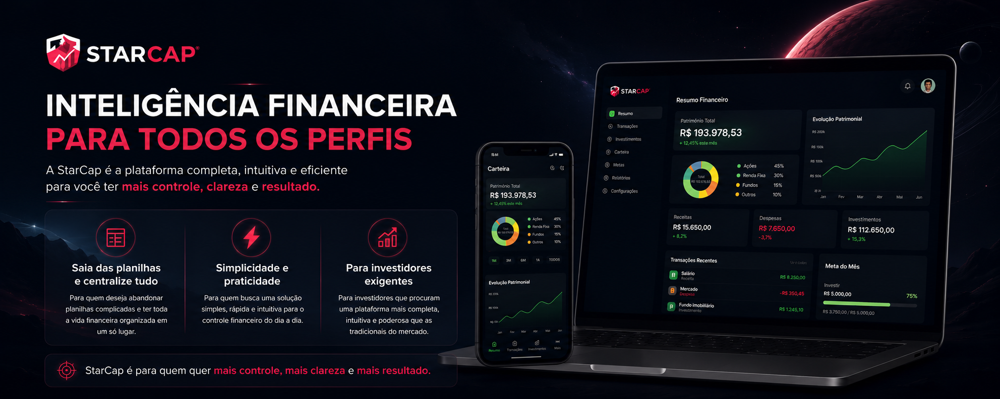
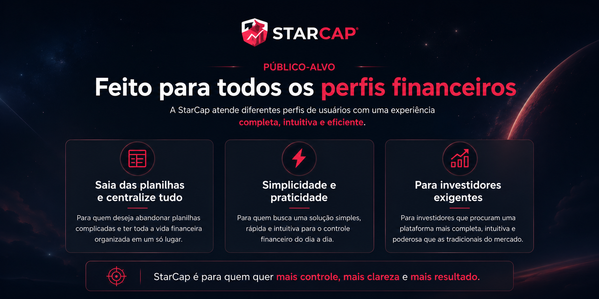
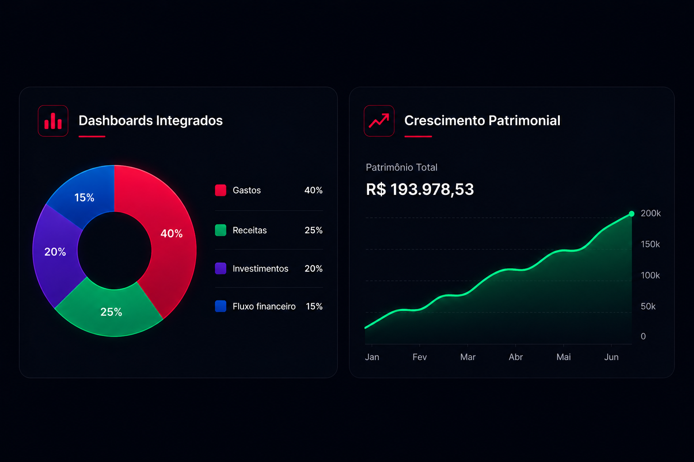

  

# StarCap

A **StarCap** é uma plataforma que une integração financeira, soberania de dados e inteligência de mercado para oferecer uma visão completa e segura do seu patrimônio.

Nosso objetivo é simplificar o acompanhamento de investimentos e permitir que você tome decisões com base em dados reais e atualizados.

  

<h2 align="center">Integração Financeira Inteligente</h2>

<h5>A StarCap centraliza todas as áreas da vida financeira em um único ecossistema integrado, permitindo uma visão estratégica e consolidada do patrimônio do usuário em tempo real.
</h5>

<table>
<tr>
<th width="260">Módulo</th>
<th width="600">Descrição</th>
</tr>

<tr>
<td align="center"><b>Fluxo de Caixa</b></td>
<td align="center">
Controle completo de receitas, despesas e movimentações financeiras diárias.
</td>
</tr>

<tr>
<td align="center"><b>Patrimônio</b></td>
<td align="center">
Consolidação automática de ativos e evolução patrimonial em tempo real.
</td>
</tr>

<tr>
<td align="center"><b>Investimentos</b></td>
<td align="center">
Monitoramento contínuo de ações, FIIs, criptomoedas e demais ativos financeiros.
</td>
</tr>

<tr>
<td align="center"><b>Metas Financeiras</b></td>
<td align="center">
Planejamento estratégico de objetivos financeiros de curto, médio e longo prazo.
</td>
</tr>

<tr>
<td align="center"><b>Análise de Impacto</b></td>
<td align="center">
Visualização de como hábitos financeiros influenciam patrimônio e investimentos futuros.
</td>
</tr>

</table>

<h4 align="center">Tecnologias Utilizadas</h4>

<h6 align="center">Mobile (Android Nativo)</h6>

<table>
<tr>
<td align="center" width="180">
 
<b>Kotlin</b> 
Jetpack Compose
</td>

<td align="center" width="180">
 
<b>Room Database</b>
</td>

<td align="center" width="180">
 
<b>Clean Architecture</b> 
MVVM
</td>

<td align="center" width="180">
 
<b>Hilt</b>
</td>

<td align="center" width="180">
 
<b>Firebase</b> 
Cloud Messaging
</td>
</tr>
</table>

<h6 align="center">Wwb e Nuvem</h6>

<table>
<tr>
<td align="center" width="180">
 
<b>Next.js</b>
</td>

<td align="center" width="180">
 
<b>Firebase</b> 
Firestore
</td>

<td align="center" width="180">
 
<b>Cloud Functions</b>
</td>

<td align="center" width="180">
 
<b>APIs Financeiras</b>
</td>

<td align="center" width="180">
   
  <b>Tailwind CSS</b> 
  Shadcn/UI
</td>
</tr>
</table>

  

 

<h3 align="center"> Inteligência financeira com performance e simplicidade.</h3>

  Plataforma moderna para controle financeiro, investimentos e crescimento patrimonial.

<h3 align="center">Experiência Premium</h3>

<table width="100%">
<tr>

<td width="33%" valign="top">
<h3 align="center">Dark Space</h3>

Interface premium em modo escuro desenvolvida para proporcionar conforto visual durante longos períodos de uso.

</td>

<td width="33%" valign="top">
<h3 align="center">Interações Rápidas</h3>

Registre despesas, receitas e movimentações financeiras em menos de 5 segundos.

</td>

<td width="33%" valign="top">
<h3 align="center">Design Inclusivo</h3>

Experiência intuitiva tanto para iniciantes quanto para investidores experientes.

</td>

</tr>
</table>

<h3 align="center">Visualização Inteligente</h3>

  

<h3>Vantagem Competitiva</h3>

A StarCap se destaca pela união de múltiplas funcionalidades em uma única plataforma moderna, inteligente e integrada.

 

<table width="100%">
<tr>

<td width="33%" align="center" valign="top">

<h3>Gestão + Investimentos</h3>

Controle financeiro diário e acompanhamento de investimentos funcionando de forma integrada e sincronizada em tempo real.

</td>

<td width="33%" align="center" valign="top">

<h3>Funcionamento Offline</h3>

A plataforma continua operando mesmo sem conexão com a internet, garantindo acessibilidade e autonomia em qualquer situação.

</td>

<td width="33%" align="center" valign="top">

<h3>Integração Inteligente</h3>

Integração automática com APIs financeiras para fornecer dados atualizados, análises inteligentes e suporte estratégico para decisões financeiras.

</td>

</tr>
</table>

 

<h3>Conclusão</h3>

A **StarCap** não é apenas um aplicativo financeiro.

Ela foi projetada como um ecossistema completo de gestão e inteligência financeira, oferecendo ao usuário mais controle, autonomia e clareza sobre sua vida financeira.

A plataforma transforma dados em decisões, simplifica a complexidade do mercado financeiro e entrega uma experiência moderna, intuitiva e eficiente para diferentes perfis de usuários.

 

<h2>
  
  StarCap
</h2>

Controle absoluto sobre sua vida financeira.

